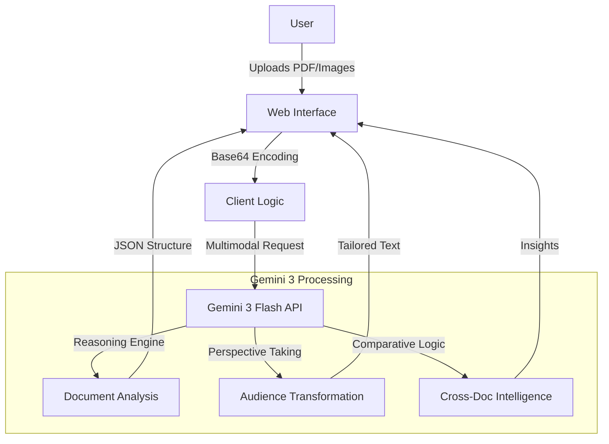

# Clarity — AI Chief of Staff

> **Powered by Gemini 3** | Built for the Gemini 3 Hackathon

Clarity uses Gemini 3's multimodal reasoning to eliminate the #1 corporate productivity killer: **information overload and miscommunication**. Upload any document — contracts, reports, presentations, screenshots, or photos of whiteboards — and get instant, actionable intelligence.

## Features

### 📊 Document Intelligence
Upload PDFs, images, screenshots, or text files. Gemini 3's multimodal reasoning extracts key insights, risks, action items, and data points in seconds.

### 👥 Audience Lens
Transform any content into perfectly tailored communications for C-Suite, Engineers, Legal, Clients, HR, or Marketing. Same facts, different framing.

### 🌐 Cross-Document Intelligence
Upload two documents and discover contradictions, gaps, connected insights, and hidden risks that only emerge when reading them together.

### 💬 Ask Clarity
Interactive AI chat with context from all your uploaded documents. Ask follow-up questions and explore deeper insights.

## Gemini 3 Integration (~200 words)

Clarity is built entirely around Gemini 3's capabilities:

**Multimodal Processing**: Clarity leverages Gemini 3's native multimodal input to process PDFs, images, screenshots, and text files without any preprocessing or OCR. Users can upload photos of whiteboards, scanned contracts, or chart screenshots — Gemini 3 understands them all natively.

**Enhanced Reasoning**: Unlike simple summarization tools, Clarity uses Gemini 3's advanced reasoning to perform deep analysis — identifying non-obvious risks, finding contradictions between documents, and generating audience-specific translations that adapt tone, vocabulary, and emphasis for each stakeholder group.

**Low Latency**: Gemini 3's reduced latency enables real-time interactive Q&A, making document analysis feel like a conversation rather than a batch process.

**Long Context**: Gemini 3's extended context window allows processing entire multi-page documents and maintaining conversation history across chat sessions.

The architecture calls Gemini 3 Flash Preview (`gemini-3-flash-preview`) via the Generative Language API, with structured JSON output for consistent UI rendering and graceful fallback handling.

## Tech Stack

- **Frontend**: HTML5, CSS3, JavaScript (Vanilla)
- **AI**: Google Gemini 3 Flash Preview API
- **Design**: Custom dark mode with glassmorphism, ambient lighting effects, and micro-animations
- **Deployment**: Static files, zero dependencies

## Live Demo
[Try Clarity Live](https://clarity-gemini-3.vercel.app)

## System Architecture



## How to Run

```bash
# Serve locally
npx http-server . -p 8080

# Or simply open index.html in your browser
```

## License

MIT
